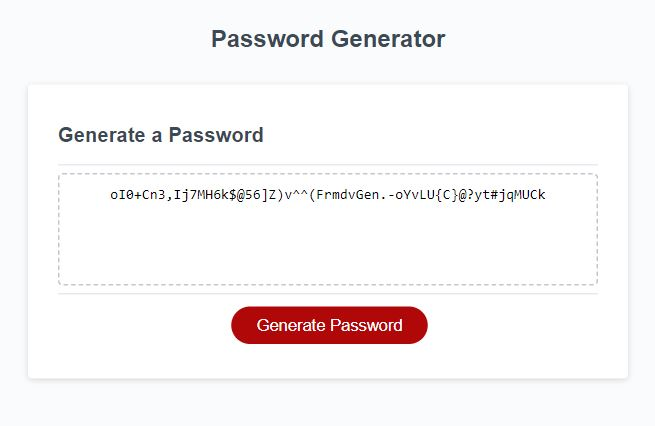

# trilogy-bootcamp-password-generator

Introduction
---

This is part of week-5 of Trilogy Bootcamp in Front End Web Development weekly challenge. 
The task is to create an application that generates a random password based on criteria a user is prompted to select.
The app will run in the browser and provide a button for a user to click once clicked a set of prompts will appear asking the user to input or to confirm choices that affect the password. 

The password will then be displayed as a single string of characters within a box in the browser. 

Acceptance Criteria
---

 - Prompts and confirmation boxes will popup when the "Generate Password" button is clicked 
and request from the user the following inputs: 
	- The password length between 10 and 64
	- If the user wants the password to include any of the following options: 
		- to contain lowercase characters
		- to contain uppercase characters
		- to contain number characters
		- to contain special characters

- The code will need to validate each user input and atleast one character type should be 
selected. 

- Once all prompts are completed the application should generate a random string of characters 
based off the users choices selected and display this generated password on the page. 

The application should look like so: 

Link to live application
---

[Password Generator Application](https://sho-ayb.github.io/trilogy-bootcamp-password-generator/)
